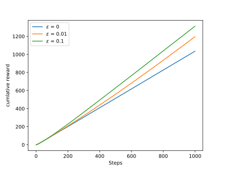
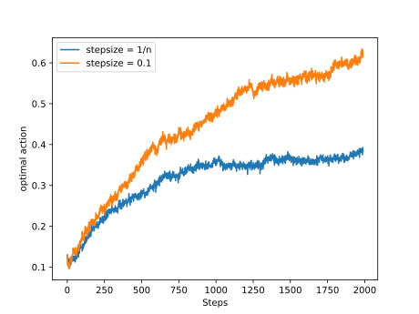

Ex2.1

The cumlative rewards are shown in the figure below generated by the Ex2.1.py. Quantitatively, after 1000 steps, the cumaltive rewards are 1026, 1200, 1306 for the explore probability  = 0, 0.01, 0.1 respectively. But I could not understand what the cumlative probability means. Cumlative probability should corresponds to some probability distribution. I think the optimal action has included the best action before the step to calculate the probability , which is not the probability distribution.

Ex2.2

The former the rewards, the less the weights. Too obvious to be true.

Ex2.3

The result is shown in figure below made by Ex2.3.py in which the action value would go random walk every 20 steps independently. As is clearly shown in the chart, the constant stepsize or the expotential recency-weighted average performs much better than the sample average. I omit the first 10 steps since it will always choose the first action which is best at the first step. I add a class named action which is a bad decision since the random walk of actions relies on the tiem in class Bandit. However, I have test the program in the condition of Fig2.2 in the book and get similar results.

Ex2.4

Because the exploration in the early steps will lead to the decrease in the action-value estimate. When the learner try all the actions once, it is likely that the estimate of the best action decrese least since the best action probably give the highest rewards. After selecting the best action according to the greedy method, its action-value estimate decrease and probably is smaller than other actions. Then the learner miss the best action. Thus, the performance oscillates.
