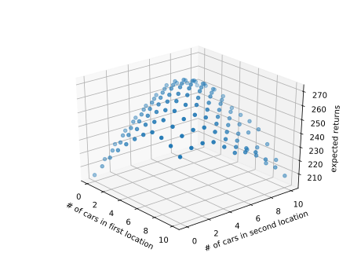

Ex4.1

The value of the pair (11, down) is -1 under random policy since the next state is the terminal state. To get the value for the pair (7, down), we need to solve the value of all states and get -15.  

Ex4.2

When the original transitions are unchanged, there is no way to get to the new state 15, so the value functions of original states remain unaltered. So we get the value for the new state 15 which is -20.  
Well, after solving the vlue functions with Ex4.2.py, I find the  value of the new state is still -20, equal to the value for original state 13. This is an understanbale concidence. So when the state 13 choose the down actions, it get the same value as itself and thus couldn't feel the new state in terms of the value functions.   

Ex4.3

Ex4.4

After running Ex4.4.py for over 36 hours to solve the full problem, I found I set the max moving cars 3 rather than 5 unfortunately. I cut the numbers in half due to my own fault. The problem is being solved with a much faster speed now. The program ends within 15 mins. There is something ambigous in the car rental. The car moved by the employee should not be counted in your moving cars. But she helps you save $2, indicating this cars should count but have no expense. In the program, it is counted in my moving cars. The optiaml policy is shown in tables below. The row index is the car numbers in first location and the column index is the cars numbers in second location. The number on a specific location is the action for that specific state. The actions change its sign in the right down corner due to the competition between the less cost to move cars from the first location to the second one due to the kind hearted employee and the less expected parking fee in second location since the expected return is smaller than the expected rented cars in secong location.  

0 |0 |0 |0 |-1 |-1 |-2 |-2 |-2 |-2 |-2
--|--|--|--|---|---|---|---|---|---|---
1 |0 |0 |0 |0 |-1 |-1 |-2 |-2 |-2 |-2   
1 |1 |0 |0 |0 |0 |-1 |-2 |-2 |-2 |-2    
1 |1 |1 |0 |0 |0 |-1 |-2 |-2 |-2 |-2    
1 |1 |1 |1 |0 |0 |-1 |-1 |-1 |-1 |-1    
2 |1 |1 |1 |1 |0 |0 |0 |0 |0 |1   
2 |2 |1 |1 |1 |1 |0 |0 |0 |2 |2   
2 |2 |2 |2 |1 |1 |1 |0 |1 |2 |2  
2 |2 |2 |2 |1 |1 |0 |0 |1 |2 |2  
2 |2 |2 |2 |1 |1 |0 |-2 |-2 |2 |2  
2 |2 |2 |2 |1 |-1 |-2 |-2 |-2 |-2 |-2   
 
 

Ex4.5

Ex4.6

Policy improvement: Now, the policy is stochastic and the action with biggest possible reward should be given as high probability as possible. And two policy are equal if they have the same probabilities for all actions in all states.  
Policy evaluation: Now the update rule should take the stochastic property of next states into account.  
Initialization: The policy for every state may be initalized as equal probabilities for each actions.

Ex4.7

First, I think other policies would take their actions to reach factors of one hundred, like 25, 50, 75 and 100. For example, the state with 70 could stake 5, 20 or 30, which are equivalent. I think the reason is that the head probability is less than 0.5. Every gamble is expected to lose money then. If you play more times in an episode, you are increasingly possible to lose money accroding to the large number theory. So we want to play as less as possible to make use of the random property to win. If we are in state 50, we should then put our fate on just one flip. If we are in state 51, we bet 1 to reach 50 or 49 to win, both are good policies.     

Ex4.8

Figure generated by Ex4.8.py for 0.25 headprobability is shown below. The value is stable, but the policy is not owing to the equivalence of the actions mentioned in Ex4.7. Since their values couldn't be exactly the same in the machine and one may be bigger than another or vice versa during iteration for some unknown and subtle reasons.

  
When the head has over 0.5 probability, we should play as much as possible to make use the law of large numbers to reach the expected gain in each play. So the policy is 1 stake each time and thus stable.

Ex4.9

