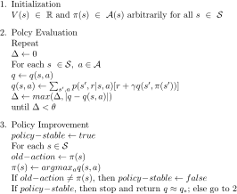

Ex4.1

The value of the pair (11, down) is -1 under random policy since the next state is the terminal state. To get the value for the pair (7, down), we need to use the value of the states and get -15.  

Ex4.2

When the original transition is unchanged, there is no way to get to the new state 15, so the value functions of original states remain unaltered. So we get the value for the new state 15 is -20.  
Well, after solving the vlue functions with Ex4.2.py, I find the  value of the new state is still -20, equal to the value for original state 13. This is an understanbale concidence. So when the state 13 choose the down actions, it get the same value as itself and thus couldn't feel the new state in terms of the value functions.   

Ex4.3

Ex4.4

After running for over 36 hours to solve the full problem, I found I set the max moving cars could 3 rather than 5 unfortunately. I cut the numbers in half due to my own fault. The problem is being solved with a much faster speed now. The program ends within 15 mins. There is something ambigous in the car rental. The car moved by the employee should not be counted in your moving cars But she helps you save $2 so this cars should count but have no expense. In the program, it is counted in my moving cars. The optiaml policy is shown in tables below. The row index is the car numbers in first location and the column index is the cars numbers in second location. The number on a specific location is the action for that specific state. The actions change its sign in the right down corner due to the competition between the less cost to move th car from the first location to the second due to the kind hearted employee and the less expected parking fee in second location since the expected return is smaller than the expected rented cars.  
0 |0 |0 |0 |-1 |-1 |-2 |-2 |-2 |-2 |-2 
-- |-- |-- |-- |-- |-- |-- |-- |-- |-- |-- 
1 |0 |0 |0 |0 |-1 |-1 |-2 |-2 |-2 |-2 
-- |-- |-- |-- |-- |-- |-- |-- |-- |-- |-- 
1 |1 |0 |0 |0 |0 |-1 |-2 |-2 |-2 |-2 
-- |-- |-- |-- |-- |-- |-- |-- |-- |-- |-- 
1 |1 |1 |0 |0 |0 |-1 |-2 |-2 |-2 |-2 
-- |-- |-- |-- |-- |-- |-- |-- |-- |-- |-- 
1 |1 |1 |1 |0 |0 |-1 |-1 |-1 |-1 |-1 
-- |-- |-- |-- |-- |-- |-- |-- |-- |-- |-- 
2 |1 |1 |1 |1 |0 |0 |0 |0 |0 |1 
-- |-- |-- |-- |-- |-- |-- |-- |-- |-- |-- 
2 |2 |1 |1 |1 |1 |0 |0 |0 |2 |2 
-- |-- |-- |-- |-- |-- |-- |-- |-- |-- |-- 
2 |2 |2 |2 |1 |1 |1 |0 |1 |2 |2 
-- |-- |-- |-- |-- |-- |-- |-- |-- |-- |-- 
2 |2 |2 |2 |1 |1 |0 |0 |1 |2 |2 
-- |-- |-- |-- |-- |-- |-- |-- |-- |-- |-- 
2 |2 |2 |2 |1 |1 |0 |-2 |-2 |2 |2 
-- |-- |-- |-- |-- |-- |-- |-- |-- |-- |-- 
2 |2 |2 |2 |1 |-1 |-2 |-2 |-2 |-2 |-2 |
-- |-- |-- |-- |-- |-- |-- |-- |-- |-- |-- 
 
 

Ex4.5

Ex4.6

Policy improvement: Now, the policy is stochastic and now the action with biggest possible reward should be given the as high probability as possible. And two policy are equal if they have the same probabilities for all actions in all states.  
Policy evaluation: Now the update rule should take the stochastic property of next states into account.  
Initialization: The policy for every state may be initalized as equal probabilities for each actions.
